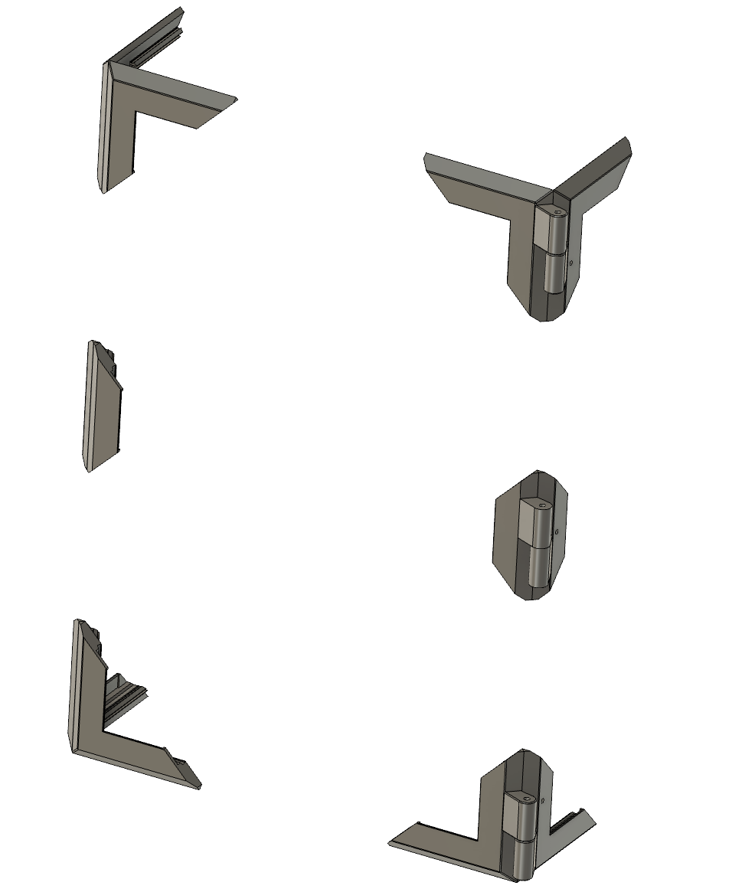
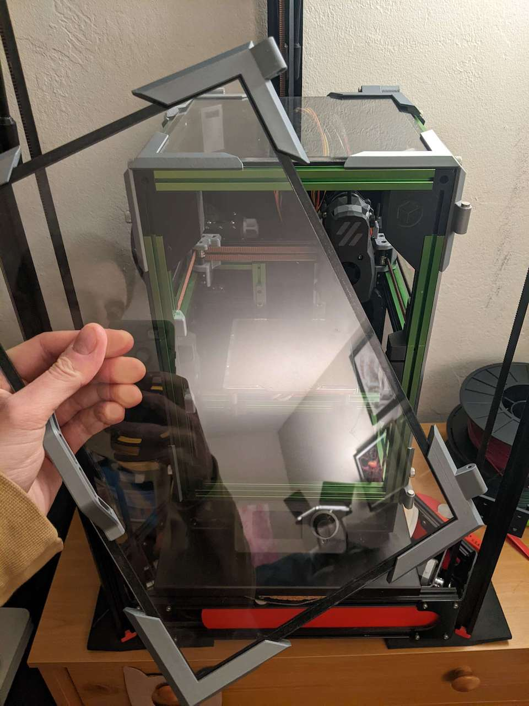
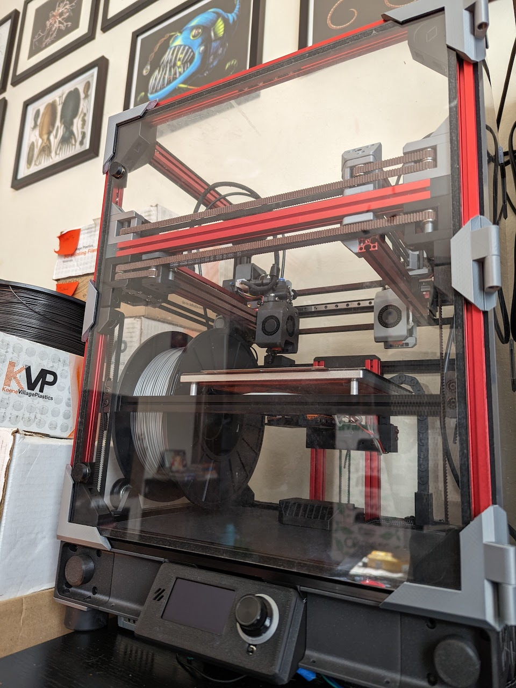
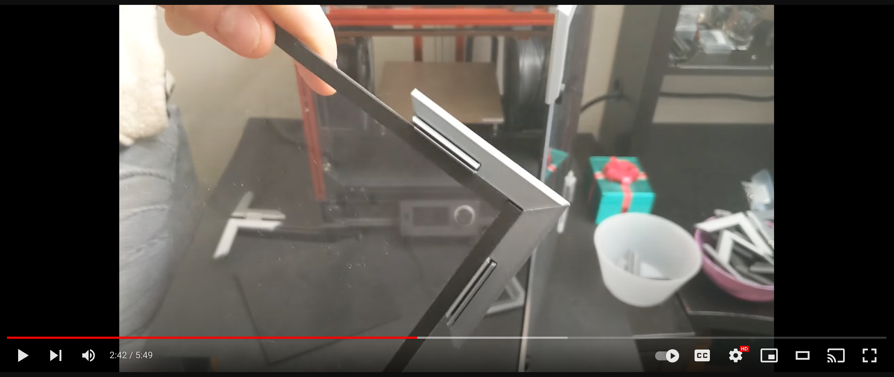
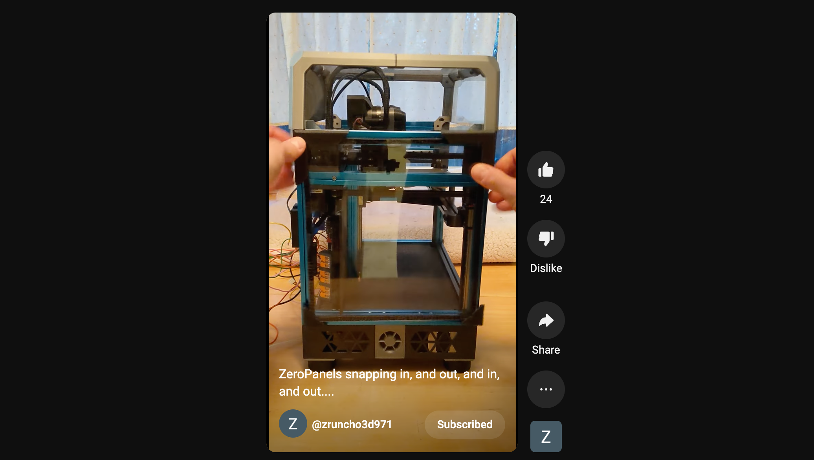
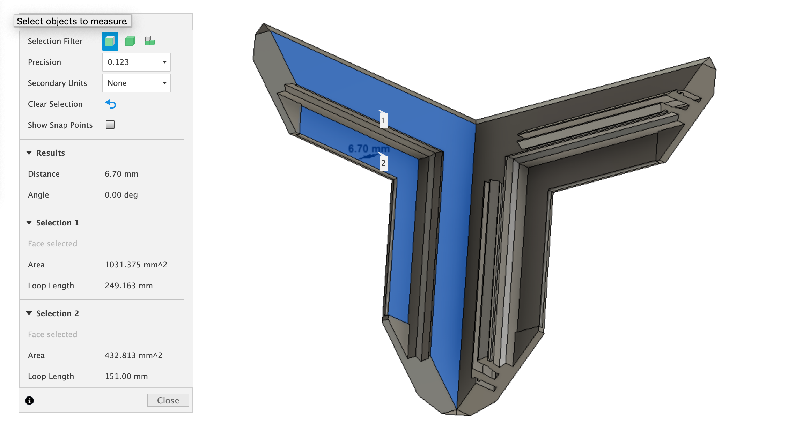
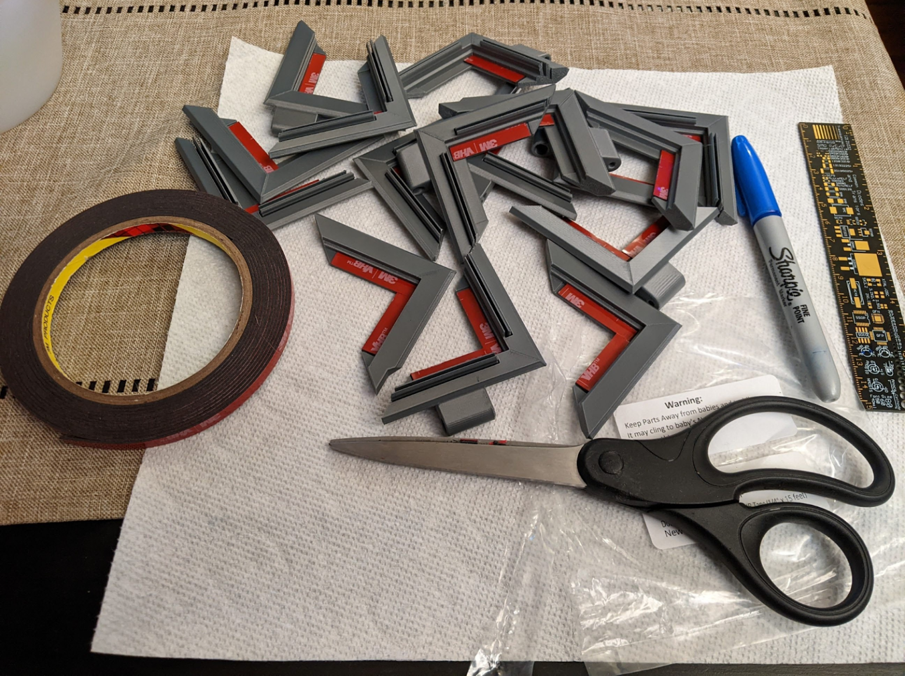
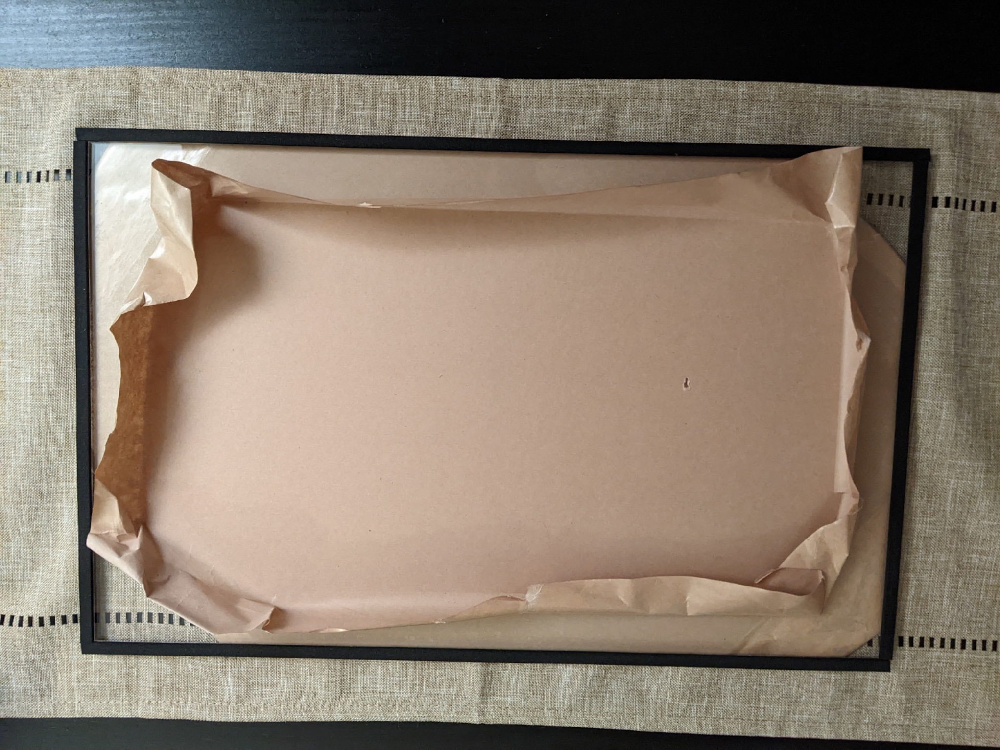

This is a fork to work with 2020 extrusions.  Navigate to that folder if you want the step file.

# ZeroPanels: the sealed, snap-in printer enclosure

**ZeroPanels** is an enclosure design for [Printers for Ants](https://3dprintersforants.com) which makes panel insertion and removal really, really, ridiculously easy.  

The design uses uses screw-less, nut-less, magnet-less, low-infill, 3D-printed clips... and it works with most 1515-based printers, including [Voron Zero](https://vorondesign.com/voron0.2)* (see Compatibility Notes below), [F-Zero](https://github.com/zruncho3d/f-zero), [Tri-Zero](https://github.com/zruncho3d/tri-zero), [Double Dragon (X0)](https://github.com/zruncho3d/double-dragon), [Micron](https://github.com/hartk1213/Micron), [Salad Fork](https://github.com/Yeriwyn/Salad_Fork), [Crucible](https://github.com/Maverick-3D/Crucible), and more.  

**Are ZeroPanels for me?** If you expect to build your printer, then never maintain it or mod it... *move along; these aren't the panels you're looking for*.

But if you've ever had to do maintenance on a printer, or really just enjoying modding and tweaking, then easy panel removal is a godsend, and worth a bit of filament, some tape, and a few magnets.

|  |  | 
| - | - | - |
| CAD Render | Zruncho's [Tri-Zero](https://github.com/zruncho3d/tri-zero) + [BoxZero](https://github.com/zruncho3d/BoxZero) w/ZPv3 
showing easy door removal and top hinge | Zruncho's [Dueling Zero](https://github.com/zruncho3d/DuelingZero) w/ZPv3 
and optional midclips|

**Version 3 adds many meaningful improvements:**
* new "one size fits most" design fits a broader range of panel sizes out-of-the-box
* no need to cut foam tape on a diagonal anymore
* new hinge parts support magnetic and screw-based hinges
* new optional screw lock for hinge bases
* new optional midclips ensure a tight fit with larger panels (like Micron+, Tri-Zero+, Dueling Zero, and others)
* new easier-to-edit, simplified Fusion 360 CAD

The minor downside is that VHB tape is now on the BOM.

[See this video](https://www.youtube.com/watch?v=6F5wUP4zZDg) for an explanation of what's new, with the v3 enclosure on [Dueling Zero](https://github.com/zruncho3d/DuelingZero).

This video is probably the best way to understand what they're like and whether they're for you.

## [> > > Watch v3 update video!](https://www.youtube.com/watch?v=6F5wUP4zZDg)

## [> > > Older v1 video shows fast insertion and removal!](https://www.youtube.com/shorts/L3nBHkO4VzE)

## Updates
* 2023-03-05 v3 Release!
* 2022-12-13 v3 Beta program begins on DoomCube Discord
* 2022-04-18  ZeroPanels motivate [BoxZero](https://github.com/zruncho3d/boxzero), a fully-boxed V0 option.
* 2022-03-03 Tecnologic shares ["Tecnologic-style" ZeroPanels](https://github.com/Tecnologic/ZeroPanels/tree/main/Mods/tecnologic/FlyingZero300) for [F-Zero](https://github.com/zruncho3d/f-zero), which have a larger corner size, as well as optional inner parts, and cover all sides.  They're really nice.  They influence v3 and BoxZero.
* 2022-01-23 Public release of original V1 ZeroPanels, which are intended mostly for just the left and right sides of a printer, and assume a tophat on top and a default V0 hinged front panel.

## Why ZeroPanels?

**No !@#$ing screws and nuts.** A default V0 enclosure (just left & right) requires 24 screws and nuts. Even with [NoDropNuts](https://github.com/zruncho3d/f-zero/tree/main/STLs/NoDropNuts) to hold the nuts in place, having to unscrew a bajillion screws to remove one panel - and then screw them all back in again - is not fun.

**Mind the gap.** Many [Printers for Ants](www.3dprintersforants.com) need an extra mm to clear an MGN7 carriage (17mm wide) when mounted inside a 1515 extrusion.  You can solve this problem by printing thicker clips and using foam tape, but if you’re going to reprint enclosure parts… you might as well avoid the pain of all those screws too.

**Seals tight.** This gap is closed by foam that you add to the panels, and the extrusion clips gently press the foam against the panels.  Speaking of which...

**Shut the front door.** ZeroPanels are sealed by default, including the front door.

**Bye-bye, tophat.**  Easily add a top-hinge panel to replace a tophat on for fully-boxed printer mods like [BoxZero](https://github.com/zruncho3d/boxzero).

**ZeroPanels FTW.**  There’s more thought and work in these little parts than you might realize.

## Bill of Materials

| Part/Material | Description | Amount | Link | Note |
| - | - | - | - | - |
| Filament | Something strong and slightly flexible | - | - | Tested with ABS, though PETG probably will work, too.  PLA is probably not a good fit here. |
| Foam Tape | 3mm or 1/8" Adhesive-backed Foam Tape | Enough to cover all panel edges | [example (Amazon) ](https://www.amazon.com/gp/product/B08MTXJBR5/ref=ppx_yo_dt_b_search_asin_title?ie=UTF8&psc=1) | The Yotache brand is nice, because it doesn't show lines on the adhesive side through the acrylic, unlike others. |
| Tape | Double-sided VHB tape (1mm-ish) | Some | [example (Amazon)](https://www.amazon.com/gp/product/B09R5ZF8XZ/ref=ppx_yo_dt_b_asin_title_o01_s00?ie=UTF8&th=1) | Doesn't need to hold *that* well; non-genuine VHB is probably fine. |
| Magnets | 6mm dia x ~3mm depth "V0 standard" magnets | 6 per hinge pair | Some | See "Choosing a Hinge" below |
| Screws | M3x35 SHCS/BHCS | 2 per hinge pair | Link | See "Choosing a Hinge" below |
| Screws | M2x12 self-tapping screw (or M2x10 in a pinch) | - | (optional) 1 per hinge | Optional screw lock.  Can also drill out the hole and use an m3 screw too, if the hole strips, or you just want an m3. |
| Nuts | M3 regular or Nylock nut | 2 per hinge pair | Link | See "Choosing a Hinge" below |
| Panels | 3mm | Depends | - | These should be sized for ~6mm beyond the inner frame width.  For example, on a V0, 200mm + 6mm * 2 --> 212mm width.  *Note*: the front door becomes the same size as the side panels, so a V0 panel kit with tophat needs a 9mm shave on the top to fit here.|

**Choosing a Hinge**: magnet or screw?  You can do one of each; Zrucho's preference is a screw-hinged top and magnet-hinged front.  You can even skip a top hinge and just use a snap-in top panel, especially if you want to flip your printer and have it sit on a flat surface frequently.

The magnet hinge enables you to grab the front panel, lift up, and remove it entirely.  The screw option enables you to tighten the screws, so that the top panel holds in place vertically, for extruder access or filament changes.

If you want a nice strong front-door close, then add 2-8 optional door magnets. The printed parts match the ZeroPanels offset, but also give a more powerful seal.  The front-door bits require a few extra parts:

| Part/Material | Description | Amount | Link | Note |
| - | - | - | - | - |
| Screw | M2x10 self-tapping screw | - | 1 per unit | Longer lengths can typically be cut down to size with strong wire cutters. |
| Screw | M3x6 FHCS | - | 1 per unit | |
| Tape | Thin double-sided tape, 1/4" / 6mm wide | - | Enough to cover one magnet per unit | Cut any size width you have to size. |
| Magnet | 1/8" thick, 3/8" diameter countersunk ring magnet | - | 2 per unit | Choose your preferred size |
| Magnet | 1/8" thick, 1/2" diameter countersunk ring magnet | - | 2 per unit | Choose your preferred size |

## Printing Tips

The unusual 45-degree orientation is what makes these possible.

For **non-hinge** parts:
* 0% infill (minimum), 2 perims (minimum), 2 bottom layers, 5 top layers, 0.6 forced width, 0.2 layer height

The wider extrusion width helps with the overhangs.  However, if you get too much corner curl with the wider width, try 0.45 or 0.5 width instead, possibly with an extra perimeter, and/or reduce the layer width to 0.16mm.

For **hinge** parts:
* Same params, except use 16% infill (minimum); extra perims may improve hinge strength too

Bed adhesion is important for a cantilevered part like this.  Consider all of these:
* a hotter heated bed
* a properly prepared PEI surface (soaped, scuffed, iso'ed)
* extra first-layer squish
* an adhesion aid like Vision Miner Nano
* brim, if still stuck

If there's an interference with the extrusions, then you'll need to fix it in CAD beforehand (using a press-pull operation is easy enough...) or use flush cutters after.  Sorry, but generating and orienting versions of every part for every printer is a maintenance burden.

Get the settings right, and each part should look perfect, even when printed at the flowrate limit of the hotend.  The sample parts below show v1 parts in KVP Stellar Black ABS, printed at 235C on an [F-Zero](https://github.com/zruncho3d/f-zero).

## Instructions

### Required Reading: understanding the thickness setting

**Always print and assemble a test panel first, because component thicknesses vary.**  

Acrylic panels, extrusions slots, foam tape, and VHB tape all vary slightly in thickness, as does each printer.  You want to ensure that these parts work for your printer, *before* printing a full set.

The default panel set assumes these sizes:
* VHB tape thickness: 1.1mm
* acrylic panel thickness: 2.9mm
* foam tape thickness: 3.0mm

This stack needs a tiny bit of squish to form a good seal.   If that stack is too skinny for the plastic part, an air gap will result.  If that stack is too thick, the tape near the hinges may separate over time, and a gap may form in the center of the panels due to bowing.  In a hot chamber, your panels might even set into a bowed position.  

By default, the stack assumes a 7.0mm stack thickness, squeezed down to 6.7mm, ensuring about 0.3mm of squish.

These numbers are based on the collected measurements from the many beta testers, in an attempt to provide a single reasonable default.

The amount of "extrusion grip" has been set similarly, to a size that should fit most extrusions and provide a reasonably satisfying, audible click, especially with LDO and MakerBeamXL extrusions.  Misumi are known to have wider slots, but you can somewhat account for this by offsetting the attachment of the corners to the panel, to effectively preload them, plus the screw locks for the hinges help here too.

If your component stack is less than 6.8mm or more than 7.2mm or so, then you're more likely to benefit from a custom size. However, if you need a size tweak, it's a straightforward change in the Fusion 360 CAD, as noted below.  **Try it first.**

### Print and assemble a test panel

#### Print and prep corners

Print 4 normal corners, using the settings above.

For each piece, cut out VHB to fit, with 90 degree cuts only, for all areas that will touch the panel.  Use two pieces for the L shapes and 1 for the straight-through mid-pieces, as shown below.

Push the tape downwards, and ensure it sits perfectly flat, or reapply the tape and try again.  A printer spatula works great for this purpose.  Looks like this:

#### Prep panel with foam tape

You can do this while your parts are printing.

Remove a panel’s length of foam tape.  Get it started at one end, then *very gently* apply a bit of tension on the tape; run your finger along the panel edge and the tape edge.  You can get a perfectly-straight application with this technique, and by not pulling too hard, you prevent ugly stuff from showing on the tape's underside.  Just make sure everything overlaps.  

Repeat for the other 3 parts to complete a panel.

Make sure to remove the acrylic panel backing first!  You can remove just the edge part to keep the panel pristine.

Then put a book on top and let it sit foam-down for a bit.  Otherwise, expect that the tape might peel up near the edges, where you’re likely to have touched it the panel with your finger oils.  You want the tape to set a bit.

#### Pre-test the panel

Make sure there are no occlusions before trying this - that is, there are no clips interfering with printed parts, and no nuts where the panels will insert.  Trim the clips if there are any occlusions.

Add all 4 clips with the red VHB backing still in place, to confirm that the stack height is about right.  Make sure the panel grips into the extrusion slots. The panel should hold securely, but remove easily when you push out from the inside, one corner at a time.  It's kinda like removing car interior pieces with plastic clips.  

Now, do the real test.

#### Assemble the panel

Remove the VHB's remaining red backing on the 4 clips. This step can be surprisingly hard if the backing sticks well to the tape itself.  Here's a protip: using a thin flat printer spatula, separate a corner of the backing from the tape.  As soon as you have a little triangle to grab, use needle-nose pliers to grab the tape and slowly peel back.  You can use this trick to avoid disturbing the VHB and having it peel away from the part.

Next, secure one plastic corner to a panel corner.  Mark the corner, say, with a Sharpie on the inside.   Squish it HARD.  Align the panel to the printer.  Do the same for the opposite corner, being careful to align it all to the extrusions.  Squish it hard.  Then add the other 2 corners in place.  To help ensure the VHB sticks as well as possible, you can pop off the panel and have some books weigh it down.  Make sure it has time to set before doing insertion/removal testing.

#### Check the fit

Look from the side, using a phone flashlight, to ensure no air gaps are present.  The panel should seal.  If it bows outward, consider using the optional mid-clips and mid-hinge for additional hold.

See if the amount of snap feels right.  See whether the assembled panel holds steady once inserted, and whether it removes with an amount of force that works for you.

**All good?**  Print the rest.

### Print the rest

#### Assembling magnetic hinges

These are simple, easy, and fast to build.

First, make a magnet pair for each hinge: literally, a pair of glued magnets with some CA glue.  It's out-of-chamber, so regular glue is fine.

Put a spot of glue into the hole on the fixed part, where the magnet pair will go; for the door, these would be on the right, and are the parts with a hole for an M2 locking screw.  Push the magnet pair in and make sure it sits flat.  Yes, a whole magnet sticks out.

Now, get the moving part, the one without a hole, with a deeper pocket.  Clean up the hole beforehand with a 6mm diameter reamer, end mill, or M6 screw.  Everything is glued here and non-critical, so a little looseness in the magnet pockets is fine; you just need the magnet to insert and remove easily, plus have space to act as a hinge.  Put a spot of glue in this part.  Then add a magnet onto the magnet pair of the fixed part from before, and press this into the pocket, just enough to become obscured.  Slide it out carefully, then press down all the way with a pen or other plastic thing that fits, until it sets from the glue.  

Test the hinge!  It should pop on and off without issue and rotate easily.  With two, the rotation will be even smoother.

#### Assemble the door

Assemble two hinge pairs and complete the right-side panel.  Attach the right-side panel and lock it in place with the M2 locks near the hinges.   Turn the screws until they hit the end and resist, but DO NOT strip them.  The screw locks don't need to be super-tight anyway; they're mostly preventing the panel clips from unclipping, vs actively pressing against the extrusion slot.  Worst-case, if you strip these, you can remove a chunk of panel clip, drill them out to m3, and have them mate to a nut in an extrusion slot.

Then assemble the door panel, ensuring that you use smooth corners, and add it.  You *can* use the panel clips everywhere, including as a door closure, but given the high cycle life there, magnetic feels right... it has an infinite cycle life.

The door should pop on and off easily.  To reattach, push the door against the front, then let it fall down into place.

Once it's in place, consider printing and attaching the optional-but-recommended magnet bumps, which cover up cylinder or ring magnets, and which grip tightly to the corresponding magnet receivers that clip into the extrusions.  The bumps attach using thin (0.1mm or so) double-sided tape.

Two magnet bumps on the left of the door is a good start, with others on top and side if you see air gaps or want a generally tighter seal.  Use more for bigger panels, too, especially for T0+ or D0-size printers.

#### Assemble a screw-based hinge (especially on top)

Similar steps here. The screw top will be exposed on the top side (assuming the door orientation), and a nylock nut goes into the pocket, and is hidden.  Tighten both screws fully only when the top and back are in place, along with the M2 screw locks on the top rear.

You can go tight enough for the hinge to hold vertically in place.

### Troubleshooting Tips

**Cooling a problem?**  Print the full plate or space out the parts on the plate.  Print thinner layers, print slower, and print cooler.

**Adhesion a problem?**  Add a brim, add more first-layer smush, print thinner layers, or use a bed adhesive.

**Strength a problem (breaking at layer lines)?**  Reduce cooling, add an enclosure, or jack up the print temp.  These are functional parts and should always be printed hotter if possible, for strength.

## CAD Notes

The CAD is designed to be understandable and modifiable, so you can do your own customizations, if not a CAD expert.

All sketches, operations, and construction planes are labeled.

Almost all dimensions of value are stored as parameters.  Here are the most useful ones:

`foam_tape_compressed_thickness`: adjust this from the default size for your stack
`no_grip_len`: increase if you want more length without a clip
`main_corner_len`: increase to 80 if you want a longer clip

Other params don't affect the corners, but make it easy to set the distances to match your printer, for easier CAD import.

Once you've made your adjustments, you'll need to export all bodies, reorient on the 45, and face all seams face backwards so that they end up hidden.

## Compatibility notes

(1) The latest [Voron Zero](https://vorondesign.com/voron0.2) (0.2) needs flat top chops on the corners for extrusion tophat compatibility (so that the clips don't interfere with the tophat plastic parts).  For compatibility with a full-height front, like those found in most V0 frame kits, you'd need to also mod the front clips a bit, since the plastic would be in the way of the top 9mm and bottom 9mm of acrylic panel.

(2) The original Dueling Zero README lists panels that are 9mm beyond the inner frame width, not 12mm.  To use these on D0, make sure to adjust the magic 'x' parameter and follow the note in the CAD, then export the parts you need.  If you go for normal-size frames, then ignore this message.

## FAQ

### What's the catch?

Because the clips enable the panels to float, the panels provide no rigidity benefit to the frame, just like [curtain walls](https://en.wikipedia.org/wiki/Curtain_wall_(architecture)) on modern skyscrapers.

However, because these panels aren't positively coupled to the frame, they may reduce noise, to make it less likely that they act as a speaker to amplify resonances.

We'll see about that one.

Another possible catch is that not every printer is dimensionally accurate, and that can affect how well the design works *for you*.  They're designed to account for variance in panel width, extrusion slot width, and panel thickness.  But if your printer prints bulges at the corners, for example, the clips may not work for you.

### Could I extend the design to fully cover extrusions?  Yes.
Yes, you could!  See the [Technologic-style version](https://github.com/Tecnologic/ZeroPanels/tree/main/Mods/tecnologic/FlyingZero300) for an example.

You'd have to think through the print orientation(s) though to fully reuse this profile.

### Can I do a double-panel version?  Yes.
Definitely.  You'd need to thicken the panels, but add an extra layer of VHB and another panel and make small mods and you may be able to do a simple double-panel setup.

## Credits

These parts are a spinoff from the [Tri-Zero](https://github.com/zruncho3d/tri-zero) project.

V3 credits:

Thanks to Grizzle357, sorkyl, Floaf, falo, SuperPringles, burningBeard, Ax4x Se7en, John, Kosh42EFG, schwaded, and Bacon for taking measurements that informed the parts here.  Thanks to chadonka for printing an entire enclosure on an in-progress D0!

V2 credits:

Unreleased, but inspired by Tecnologic.  The CAD got out of hand and needed to be redone properly, starting over from the first sketch.

V1 credits:

Thanks to Yeri, Speedy, Ericsson, RogueNeurons, Maverick, Sparkss, rok3, flyespresso, tecnologic, and Lowstream on the [DoomCube Discord](https://discord.gg/doomcube) for extrusion measurements.

Thanks to Ericsson, RogueNeurons, Maverick, Yeri, rok3, flyespresso, StoicHollow, Lowstream, and Tigran on the [DoomCube Discord](https://discord.gg/doomcube) for sharing test-print feedback!

